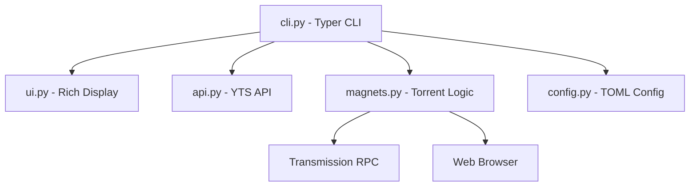

# Architecture

> Auto-generated by /map on 2026-03-03

## Overview

CineCLI is a cross-platform command-line tool written in Python that allows users to browse movies, view details, and launch torrents (via magnet links or .torrent files). It uses the YTS API as its primary movie data source and supports both browser-based magnet handling and direct integration with Transmission.

## Components

### CLI (Entry Point)
- **Purpose:** Handles command-line arguments and orchestrates the user flow.
- **Location:** `cinecli/cinecli/cli.py`
- **Dependencies:** `typer`, `rich`, `cinecli.api`, `cinecli.ui`, `cinecli.magnets`, `cinecli.config`

### API Wrapper
- **Purpose:** Communicates with the YTS v2 API to fetch movie lists and details.
- **Location:** `cinecli/cinecli/api.py`
- **Dependencies:** `requests`

### UI Renderer
- **Purpose:** Formats movie data and torrent lists into beautiful terminal tables and layouts.
- **Location:** `cinecli/cinecli/ui.py`
- **Dependencies:** `rich`

### Magnet & Torrent Logic
- **Purpose:** Builds magnet links, selects optimal torrents based on quality/seeds, and handles downloading via Transmission or browser.
- **Location:** `cinecli/cinecli/magnets.py`
- **Dependencies:** `transmission-rpc`, `webbrowser`, `urllib.parse`

### Configuration Manager
- **Purpose:** Loads user settings (like Transmission credentials) from a TOML file.
- **Location:** `cinecli/cinecli/config.py`
- **Dependencies:** `tomli` / `tomllib`, `pathlib`

## Data Flow

1. **Input:** User runs a command (e.g., `cinecli search "Inception"`).
2. **Fetch:** `cli.py` calls `api.py` to get movie data from YTS.
3. **Display:** `ui.py` renders the movie list.
4. **Action:** User selects a movie; `cli.py` fetches full details and torrents.
5. **Execution:** User chooses a torrent; `magnets.py` generates a magnet link and opens it in a browser or adds it to Transmission.

## Integration Points

| Service | Type | Purpose |
|---------|------|---------|
| YTS.bz API | REST API | Movie metadata and torrent links |
| Transmission | RPC | Remote torrent management (optional) |

## Technical Debt

- [ ] **No Tests:** There are no unit or integration tests in the current codebase.
- [ ] **Limited Documentation:** Code comments are sparse, and there's no technical documentation beyond the README.
- [ ] **Hardcoded Trackers:** Torrent trackers are hardcoded in `magnets.py`.
- [ ] **Synchronous I/O:** API calls and Transmission RPC are synchronous, which might block the UI.

## Conventions

**Naming:** PEP 8 (snake_case for functions and variables).
**Structure:** Standard Python package structure with a `pyproject.toml` and `cinecli/` source folder.
**Testing:** None observed.
